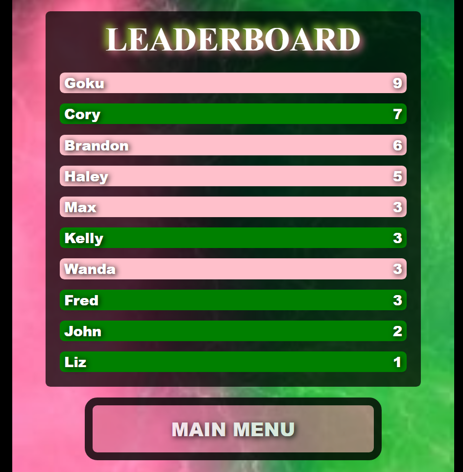
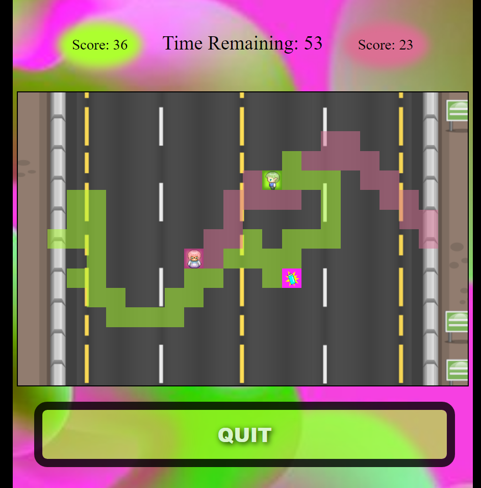

## Project title

Colorant - A game where your goal is to dominate the field.  Run around the board and leave paint in your trail.  Paint over your enemy if you must.

## Screenshots

## Tech/framework used

<b>Built with</b>
- Javascript
- HTML/CSS 
-[Animate.css](https://animate.style/)

## Features
-Persistent local Leaderboard 
-Custom Logo 
-Power-up Mechanics 
-2 Players

## Demonstration

-[Game can be played here!](https://normanatee3.github.io/Colorant/)

## How to use?

    At the Main Menu, press  -START-  to initiate the game.
    
    Player 1  -Green-  enters their Name, then Player 2  -Pink- .
    
    You have until the  -TIMER-  runs out to move around, painting as much of the street your color as possible. But be careful! Your opponent can paint over you!
    
    The player with the highest  -SCORE-  at the end wins, and if their score is high enough, it will appear on the  -LEADERBOARD- .
    
    In the case of a tie, the  -TIMER-  will turn red, and you'll go into  -OVERTIME- . 
    
    Keep battling until somebody wins!
    
    CONTROLS: 

    Player 1:
    
    UP --- W
    LEFT --- A
    DOWN --- S
    RIGHT --- D
    
    Player 2:
    
    UP --- Arrow Up
    LEFT --- Arrow Left
    DOWN --- Arrow Down
    RIGHT --- Arrow Right
    
    Keep an eye out for power-ups!

## Credits

Logo animation by -[Animate.css](https://animate.style/) 
Character Design by -[RPGMakerMV](https://www.rpgmakerweb.com/products/rpg-maker-mv) 
Logo Design by: Norman K. Taylor 
Game Design by: Norman K. Taylor